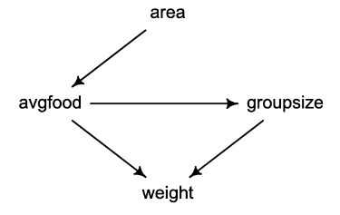

```{r}
library(rethinking)

set.seed(100)
```

`data(foxes)` contains data for 116 foxes from 30 different urban groups in England.

1. `group`: Number of the social group the individual fox belongs to
2. `avgfood`: The average amount of food available in the territory
3. `groupsize`: The number of foxes in the social group
4. `area`: Size of the territory
5. `weight`: Body weight of the individual fox

```{r}
# load the data
data(foxes)
d <- foxes

# show the data frame 
print(d)

# summarize the data
precis(d)
```

We assume the following DAG:



# Q1

We would like to infer the total causal effect of `area` on `weight`. There are no backdoor paths from `area` to `weight` in our DAG, so we only need to include `area` as a predictor to do so.

```{r}
plot(weight ~ area, data=d)
```
We use the following model:

$D_i \sim \text{Normal}(\mu, \sigma)$ \
$\mu_i = \alpha + \beta A_i$ \
$\alpha \sim \text{Normal}(0, 0.2)$ \
$\beta_A \sim \text{Normal}(0, 0.5)$ \
$\sigma \sim \text{Exponential}(1)$

```{r}
# standardize variables
d$W <- scale(d$weight)
d$A <- scale(d$area)

plot(W ~ A, data=d)
```

```{r}
# define the model formulae
flist <- alist(
  W ~ dnorm(mu, sigma),
  mu <- a + b * A,
  a ~ dnorm(0, 0.2),
  b ~ dnorm(0, 0.5),
  sigma ~ dexp(1)
)

# fit model using quadratic approximation
model <- quap(flist, data=d)
```

```{r}
# prior predictive simulation
prior <- extract.prior(model)
mu <- link(model, post=prior, data=list(A=c(-2, 2)))
plot(NULL, xlim=c(-2, 2), ylim=c(-2, 2), xlab="Area (std)", ylab="Weight (std)")
for (i in 1:50)
  lines(c(-2, 2), mu[i,], col=col.alpha("black", 0.4))
```

```{r}
precis(model)
```

```{r}
# compute percentile interval of mean
A_seq <- seq(from=-3 , to=3.2 , length.out=10)
mu <- link(model, data=list(A=A_seq))
mu.mean <- apply(mu, 2, mean)
mu.PI <- apply(mu, 2, PI)

# plot it all
plot(W ~ A, data=d, col=rangi2)
lines(A_seq , mu.mean, lwd=2)
shade(mu.PI , A_seq)
```

Area does not seem to have any total causal effect on weight for this sample.

# Q2

We would like to infer the causal effect of `avgfood` on `weight`. Again, there are no backdoor paths, so we just need to include `avgfood` as a predictor.

```{r}
# standardize variables
d$W <- scale(d$weight)
d$F <- scale(d$avgfood)

plot(W ~ F, data=d)
```

We will use a similar model to Q1.

```{r}
# define the model formulae
flist <- alist(
  W ~ dnorm(mu, sigma),
  mu <- a + b * F,
  a ~ dnorm(0, 0.2),
  b ~ dnorm(0, 0.5),
  sigma ~ dexp(1)
)

# fit model using quadratic approximation
model <- quap(flist, data=d)
```

```{r}
# prior predictive simulation
prior <- extract.prior(model)
mu <- link(model, post=prior, data=list(F=c(-2, 2)))
plot(NULL, xlim=c(-2, 2), ylim=c(-2, 2), xlab="avgfood (std)", ylab="Weight (std)")
for (i in 1:50)
  lines(c(-2, 2), mu[i,], col=col.alpha("black", 0.4))
```

```{r}
precis(model)
```

```{r}
# compute percentile interval of mean
F_seq <- seq(from=-3 , to=3.2 , length.out=10)
mu <- link(model, data=list(F=F_seq))
mu.mean <- apply(mu, 2, mean)
mu.PI <- apply(mu, 2, PI)

# plot it all
plot(W ~ A, data=d, col=rangi2)
lines(F_seq , mu.mean, lwd=2)
shade(mu.PI , F_seq)
```

There does not seem to be a causal effect of `avgfood` on `weight`.

# Q3

We would like to infer the causal effect of `groupsize` on `weight`. There is a backdoor path through `avgfood`, which we can close by conditioning on it. We therefore include both `groupsize` and `avgfood` as predictors.

```{r}
# standardize variables
d$W <- scale(d$weight)
d$G <- scale(d$groupsize)
d$F <- scale(d$avgfood)

plot(W ~ G, data=d)
```

We will use a similar model to Q1 and Q2, but including both `groupsize` and `avgfood` as predictors.

```{r}
# define the model formulae
flist <- alist(
  W ~ dnorm(mu, sigma),
  mu <- a + bG*G + bF*F,
  a ~ dnorm(0, 0.2),
  c(bG, bF) ~ dnorm(0, 0.5),
  sigma ~ dexp(1)
)

# fit model using quadratic approximation
model <- quap(flist, data=d)
```

```{r}
precis(model)
```

```{r}
# compute percentile interval of mean
G_seq <- seq(from=-3 , to=3.2 , length.out=10)
F_seq <- seq(from=-3 , to=3.2 , length.out=10)

mu <- link(model, data=list(G=G_seq, F=F_seq))
mu.mean <- apply(mu, 2, mean)
mu.PI <- apply(mu, 2, PI)

# plot it all
plot(W ~ G, data=d, col=rangi2)
lines(G_seq , mu.mean, lwd=2)
shade(mu.PI , G_seq)
```

There does not seem to be a total causal effect of `groupsize` on `weight`. However, `groupsize` does seem to have a direct, negative causal effect on `weight`, while `avgfood` has a direct, positive effect on `weight`. This makes ecological sense.